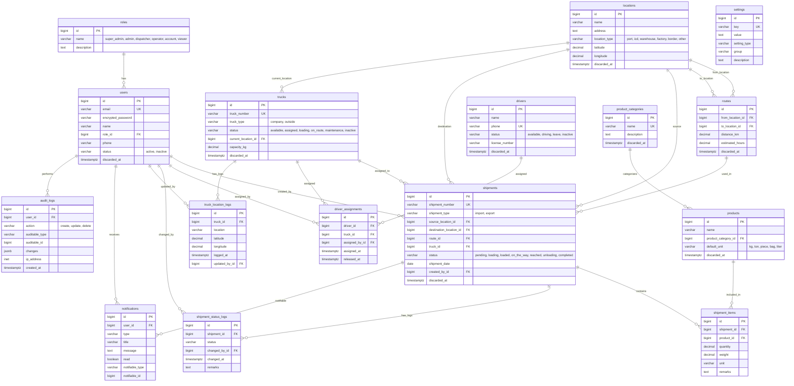

# Entity Relationship Diagram (ERD)
## Transport & Shipment Management System

---

## 1. Core Entity Relationships (Text Diagram)

```
┌─────────────┐       ┌──────────────┐       ┌──────────────────┐
│    roles     │       │   locations   │       │ product_categories│
├─────────────┤       ├──────────────┤       ├──────────────────┤
│ id (PK)     │       │ id (PK)      │       │ id (PK)          │
│ name        │──┐    │ name         │       │ name             │
│ description │  │    │ location_type│──┐    │ description      │
└─────────────┘  │    │ city         │  │    └──────────────────┘
                 │    │ division     │  │              │
                 │    │ country      │  │              │
                 │    └──────────────┘  │              │
                 │            │         │              │
                 │            │         │              │
                 │   ┌────────┘         │              │
                 │   │                  │              │
                 │   │                  │              │
   ┌─────────────┐  │  ┌──────────────┐ │  ┌──────────────────┐
   │    users     │  │  │    routes    │ │  │    products       │
   ├─────────────┤  │  ├──────────────┤ │  ├──────────────────┤
   │ id (PK)     │  │  │ id (PK)      │ │  │ id (PK)          │
   │ email       │  │  │from_loc (FK)─┼─┘  │ name             │
   │ role_id (FK)┼──┘  │to_loc (FK)───┼──┐ │ category_id (FK)─┼──┐
   │ name        │     │ distance_km  │  │ │ default_unit     │  │
   │ phone       │     │ est_hours    │  │ └──────────────────┘  │
   └─────────────┘     └──────────────┘  │                       │
                                              │                       │
                                              │                       │
   ┌─────────────┐     ┌──────────────┐     │                       │
   │   trucks     │     │   drivers    │     │                       │
   ├─────────────┤     ├──────────────┤     │                       │
   │ id (PK)     │     │ id (PK)      │     │                       │
   │ truck_number│     │ name         │     │                       │
   │ truck_type  │     │ phone        │     │                       │
   │ status      │     │ status       │     │                       │
   │ current_loc │──┐  │ license_no   │     │                       │
   │ capacity_kg │  │  └──────────────┘     │                       │
   └─────────────┘  │       │              │                       │
       │            │       │              │                       │
       │            │       │              │                       │
       │     ┌──────┘       │              │                       │
       │     │              │              │                       │
       │     │  ┌────────────────────────────┐                    │
       │     │  │    driver_assignments      │                    │
       │     │  ├────────────────────────────┤                    │
       │     │  │ id (PK)                    │                    │
       │     └──┤ truck_id (FK)             │                    │
       │        │ driver_id (FK)            │                    │
       │        │ assigned_by_id (FK→users) │                    │
       │        │ assigned_at               │                    │
       │        │ released_at               │                    │
       │        └────────────────────────────┘                    │
       │                                                          │
       │  ┌─────────────────────────────────────┐                │
       │  │      truck_location_logs             │                │
       │  ├─────────────────────────────────────┤                │
       └──┤ truck_id (FK)                      │                │
          │ location                           │                │
          │ logged_at                          │                │
          │ updated_by_id (FK→users)           │                │
          └─────────────────────────────────────┘                │
                                                                 │
   ┌───────────────────────────────────────────────────────────┐ │
   │                      shipments                             │ │
   ├───────────────────────────────────────────────────────────┤ │
   │ id (PK)                                                   │ │
   │ shipment_number (UNIQUE)                                  │ │
   │ shipment_type (import/export)                             │ │
   │ source_location_id (FK→locations)                         │ │
   │ destination_location_id (FK→locations)                    │ │
   │ route_id (FK→routes)                                     │ │
   │ truck_id (FK→trucks)                                     │ │
   │ status (pending/loading/loaded/on_the_way/reached/       │ │
   │         unloading/completed)                              │ │
   │ shipment_date                                             │ │
   │ estimated_delivery_date                                   │ │
   │ actual_delivery_date                                      │ │
   │ created_by_id (FK→users)                                  │ │
   └───────────────────────────────────────────────────────────┘
       │                    │                    │
       │                    │                    │
       ▼                    ▼                    ▼
   ┌──────────────┐  ┌──────────────────┐  ┌──────────────────────┐
   │ shipment_items│  │shipment_status_  │  │    notifications     │
   ├──────────────┤  │      logs        │  ├──────────────────────┤
   │ id (PK)      │  ├──────────────────┤  │ id (PK)              │
   │shipment(FK)  │  │ id (PK)          │  │ user_id (FK)         │
   │product(FK)───┼──┤ shipment_id (FK) │  │ type                 │
   │ quantity     │  │ status           │  │ title                │
   │ weight       │  │ changed_by (FK)  │  │ message              │
   │ unit         │  │ changed_at       │  │ read                 │
   │ remarks      │  │ remarks          │  │ notifiable (poly)    │
   └──────────────┘  └──────────────────┘  └──────────────────────┘

   ┌──────────────────────┐  ┌──────────────────────┐
   │     audit_logs        │  │      settings         │
   ├──────────────────────┤  ├──────────────────────┤
   │ id (PK)              │  │ id (PK)              │
   │ user_id (FK)         │  │ key (UNIQUE)         │
   │ action               │  │ value                │
   │ auditable_type       │  │ setting_type         │
   │ auditable_id         │  │ group                │
   │ changes (jsonb)      │  │ description          │
   │ ip_address           │  └──────────────────────┘
   │ created_at           │
   └──────────────────────┘
```

---

## 2. Mermaid ER Diagram



---

## 3. Relationship Summary

| Parent → Child | Type | Foreign Key | Notes |
|----------------|------|-------------|-------|
| `roles` → `users` | 1:N | `users.role_id` | Each user has one role |
| `users` → `shipments` | 1:N | `shipments.created_by_id` | Creator of shipment |
| `users` → `driver_assignments` | 1:N | `driver_assignments.assigned_by_id` | Who assigned |
| `users` → `shipment_status_logs` | 1:N | `shipment_status_logs.changed_by_id` | Who changed status |
| `users` → `audit_logs` | 1:N | `audit_logs.user_id` | Who performed action |
| `users` → `notifications` | 1:N | `notifications.user_id` | Notification recipient |
| `locations` → `routes` (from) | 1:N | `routes.from_location_id` | Route origin |
| `locations` → `routes` (to) | 1:N | `routes.to_location_id` | Route destination |
| `locations` → `shipments` (source) | 1:N | `shipments.source_location_id` | Shipment origin |
| `locations` → `shipments` (dest) | 1:N | `shipments.destination_location_id` | Shipment destination |
| `locations` → `trucks` (current) | 1:N | `trucks.current_location_id` | Truck's current location |
| `trucks` → `shipments` | 1:N | `shipments.truck_id` | Truck assigned to shipment |
| `trucks` → `driver_assignments` | 1:N | `driver_assignments.truck_id` | Truck's driver history |
| `trucks` → `truck_location_logs` | 1:N | `truck_location_logs.truck_id` | Location history |
| `drivers` → `driver_assignments` | 1:N | `driver_assignments.driver_id` | Driver's assignment history |
| `product_categories` → `products` | 1:N | `products.product_category_id` | Product category |
| `products` → `shipment_items` | 1:N | `shipment_items.product_id` | Products in shipment |
| `shipments` → `shipment_items` | 1:N | `shipment_items.shipment_id` | Items in a shipment |
| `shipments` → `shipment_status_logs` | 1:N | `shipment_status_logs.shipment_id` | Status change history |
| `shipments` → `notifications` | 1:N (Poly) | `notifications.notifiable` | Polymorphic |

---

## 4. Enum Values

### `users.status`
```
active
inactive
```

### `trucks.truck_type`
```
company
outside
```

### `trucks.status`
```
available       → ট্রাক ফ্রি, নতুন Shipment-এ assign করা যাবে
assigned        → কোনো Shipment-এ assign করা হয়েছে
loading         → লোডিং চলছে
on_route        → গন্তব্যের পথে আছে
maintenance     → মেরামত চলছে
inactive        → বন্ধ/অব্যবহৃত
```

### `drivers.status`
```
available       → ফ্রি, নতুন assign করা যাবে
driving         → গাড়ি চালাচ্ছে
leave           → ছুটিতে
inactive        → বন্ধ/অব্যবহৃত
```

### `shipments.shipment_type`
```
import          → আমদানি
export          → রপ্তানি
```

### `shipments.status`
```
pending         → অপেক্ষমাণ
loading         → লোডিং হচ্ছে
loaded          → লোডিং শেষ
on_the_way      → পথে আছে
reached         → গন্তব্যে পৌঁছেছে
unloading       → আনলোডিং হচ্ছে
completed       → সম্পন্ন
```

### `locations.location_type`
```
port            → বন্দর (Chittagong Port, Mongla Port)
icd             → ICD (Inland Container Depot)
warehouse       → গোডাউন
factory         → কারখানা
border          → বর্ডার (Benapole, Burimari)
other           → অন্যান্য
```

### `notifications.type`
```
shipment_completed
driver_changed
truck_assigned
export_created
```

### `audit_logs.action`
```
create
update
delete
```

---

## 5. Key Design Decisions (Why This Schema?)

| Decision | Rationale |
|----------|-----------|
| **Enum on Shipment** (not separate table) | Status is finite (7 values); enum is simpler, faster, Rails-native; history preserved in `shipment_status_logs` |
| **Single Shipment table** (not import/export separate) | 90% same fields; `shipment_type` enum suffices; simpler queries for cross-type reports |
| **Separate `locations` table** | Reusable across routes, shipments, trucks; GPS-ready; avoids duplicate address entry |
| **`driver_assignments` with `released_at`** | Full assignment history; NULL = currently assigned; simple query for active assignment |
| **`truck_location_logs` not `current_location` only** | History matters; `trucks.current_location_id` = shortcut for current location; logs = full trail |
| **Soft Delete (`discarded_at`)** | Deleting a truck/driver would break historical shipments; `discard` gem adds `kept?`/`discarded?` scopes |
| **`audit_logs` (jsonb changes)** | Know who changed what, when; jsonb stores before/after; crucial for accountability |
| **`shipment_items` separate from `products`** | Same product can appear in multiple shipments with different qty/weight |
| **Polymorphic `notifications`** | One notifications table for any notifiable entity (Shipment, Assignment, etc.) |
